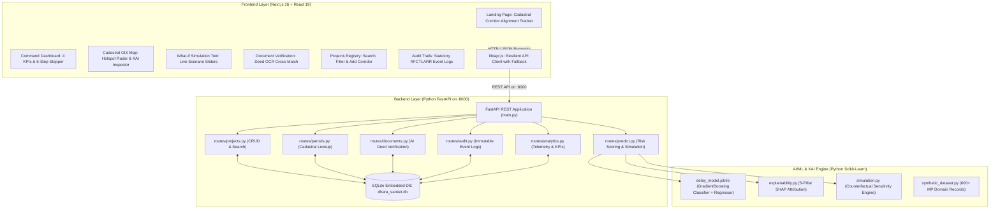

# Dhara-Sanket AI (SIH26017)
### Predictive Analytics System for Early Detection of Land Acquisition Delays
**Smart India Hackathon 2026** | **Theme:** Smart Automation | **Category:** Software  
**Team:** Catalyst

---

## 📌 Executive Summary

**Dhara-Sanket AI** is a predictive analytics and early-warning intelligence platform designed to transform state and national land acquisition monitoring from **reactive dispute management** into **proactive delay prevention**.

By synthesizing satellite GIS telemetry, state cadastral revenue records (**MP Bhulekh**), judicial court dockets, and statutory **RFCTLARR Act 2013** guidelines, the system:
1. **Predicts** project acquisition delays months before physical ground-breaking.
2. **Explains** the exact bottleneck drivers using transparent Explainable AI (XAI).
3. **Simulates** targeted administrative interventions ("What-If" policy modeling) to quantify time and cost savings.
4. **Verifies** land deed documentation via automated AI OCR cross-matching.
5. **Maintains** an immutable statutory audit trail for defensible administrative governance.

---

## 🏗️ Technical Architecture & System Flow



---

## 📂 Repository Structure

The codebase is organized into **3 clean, modular tiers**:

```
Dhara-Sanket-AI/
├── frontend/                     # Next.js 16 (App Router) + React 19
│   ├── app/                      # Route Pages
│   │   ├── page.js               # Landing Page with Corridor Survey Alignment Tracker
│   │   ├── dashboard/page.js     # Executive Command Dashboard (6-Step Stepper)
│   │   ├── gis-map/page.js       # Cadastral Map + XAI Inspector + What-If Simulation
│   │   ├── documents/page.js     # Digital Document Submission & AI OCR Verification
│   │   ├── active-projects/      # Corridor Registry with instant search & Add Modal
│   │   ├── high-risk/            # High-Risk Dispute Triage
│   │   ├── reports/              # RFCTLARR Statutory Compliance & Analytics
│   │   ├── audit-logs/           # Immutable Audit Trail & Decision Ledger
│   │   ├── layout.js             # Shell layout with Sidebar & Topbar
│   │   └── globals.css           # Gov-Tech design tokens & theme variables
│   ├── components/               # Reusable UI Components
│   │   ├── Sidebar.js            # Collapsible Gov-Tech navigation sidebar
│   │   ├── Topbar.js             # Header with route breadcrumbs & telemetry status
│   │   ├── GISMap.js             # SVG Cadastral hot spot radar map of MP
│   │   ├── ProjectTable.js       # Searchable data table with status pills
│   │   ├── RiskScoreRing.js      # Circular SVG risk score gauge
│   │   ├── StatCard.js           # Metric card with trends and icons
│   │   └── AlertList.js          # Live dispute & discrepancy ticker feed
│   └── lib/
│       ├── api.js                # Frontend API client with resilient mock fallback
│       └── mockData.js           # Initial seed data for projects, parcels, and alerts
│
├── backend/                      # Python FastAPI REST API
│   ├── main.py                   # FastAPI entrypoint, CORS middleware & route registration
│   ├── database.py               # SQLite relational storage (dhara_sanket.db) + seeders
│   ├── models.py                 # Pydantic schemas (Project, Parcel, Prediction, Simulation)
│   ├── routes/                   # Modular API route controllers
│   │   ├── projects.py           # GET/POST endpoints for acquisition corridors
│   │   ├── parcels.py            # GET endpoints for cadastral survey parcels
│   │   ├── predict.py            # POST endpoints for ML delay scoring & simulation
│   │   ├── documents.py          # GET/POST endpoints for deed verification
│   │   ├── audit.py              # GET endpoint for statutory compliance audit logs
│   │   └── analytics.py          # GET endpoints for telemetry stats & chart data
│   └── requirements.txt          # Python dependencies
│
└── ml/                           # Machine Learning & Explainable AI
    ├── synthetic_dataset.py      # Domain-specific dataset generator (RFCTLARR factors)
    ├── synthetic_dataset.csv     # 600+ historical project training records
    ├── train_model.py            # GradientBoosting Classifier & Regressor training pipeline
    ├── delay_model.joblib        # Serialized trained model artifact
    ├── explainability.py         # SHAP-inspired XAI feature attribution breakdown
    └── simulation.py             # What-If scenario intervention modeling engine
```

---

## ⚙️ How the Code Works Under the Hood

### 1. Frontend Architecture (`frontend/`)
* **Framework**: Next.js 16 with React 19 (App Router).
* **Styling Paradigm**: Gov-Tech CSS modules + global CSS variables (`--brand`, `--card`, `--border`). Designed to look like an authentic, trustworthy Indian Government enterprise portal (inspired by *PM Gati Shakti* and *MP Bhulekh*) with accessible contrast, deep navy backgrounds, and crisp administrative typography.
* **Resilient API Layer (`lib/api.js`)**:
  All pages communicate with the FastAPI backend through `lib/api.js`. If the backend is temporarily offline during live demonstrations, `lib/api.js` automatically catches network errors and falls back to local domain seed data without throwing errors or breaking the UI.
* **Reactive What-If Simulation UI (`app/gis-map/page.js`)**:
  Allows officials to adjust scenario sliders (*Compensation Multiplier*, *Title Fast-Tracking*, *Lok Adalat Injunction Resolution*, *FRA Gram Sabha Consent*). When modified, the component dispatches a JSON payload to `POST /api/simulate` and immediately updates the circular SVG risk gauge, point reduction badges, and estimated months saved.

### 2. Backend REST API Architecture (`backend/`)
* **Framework**: Python FastAPI + Uvicorn + Pydantic v2.
* **Database**: Embedded SQLite (`dhara_sanket.db`). Automatically initializes tables (`projects`, `parcels`, `documents`, `alerts`, `audit_logs`) and seeds realistic Madhya Pradesh infrastructure project data on startup with **zero external database configuration required**.
* **Key Endpoints**:
  | Method | Endpoint | Description |
  | :--- | :--- | :--- |
  | `GET` | `/api/health` | Service health status and OpenAPI metadata |
  | `GET` | `/api/projects` | List corridors with district/risk/search filters |
  | `POST` | `/api/projects` | Register a new land acquisition corridor |
  | `GET` | `/api/parcels` | Query cadastral survey parcels and boundary data |
  | `POST` | `/api/predict/parcel` | Execute ML delay prediction & XAI feature attribution |
  | `POST` | `/api/simulate` | Execute What-If policy intervention simulation |
  | `GET` | `/api/documents` | Retrieve submitted land deeds and OCR verification records |
  | `POST` | `/api/documents/verify` | AI OCR cross-matching deed against MP Bhulekh records |
  | `GET` | `/api/audit-logs` | Retrieve statutory compliance audit logs |
  | `GET` | `/api/stats` | Executive telemetry KPIs |

### 3. Machine Learning & Explainable AI (XAI) Engine (`ml/`)
* **Model Pipeline (`ml/train_model.py`)**:
  Trained on domain features extracted from historical land acquisition bottlenecks in Madhya Pradesh:
  1. `active_court_stays`: High Court/Civil Court stay injunctions (**37.4% feature importance**).
  2. `num_title_holders`: Inheritance splits and multi-claimant friction (**14.5% importance**).
  3. `rate_deviation_pct`: Disparity between market value and circle rate (**13.8% importance**).
  4. `gram_sabha_pending`: Schedule V / FRA 2006 tribal consensus requirement (**13.4% importance**).
  5. `deed_mismatch`: Sub-Registrar deed vs MP Bhulekh revenue discrepancy (**5.0% importance**).
  6. `is_forest`: Eco-sensitive and Stage-I forest clearance requirement (**4.8% importance**).
  7. `area_ha`: Total parcel footprint scale (**4.5% importance**).
* **Dual-Output Architecture**:
  * **Classifier**: `GradientBoostingClassifier` predicting risk category (`High`, `Medium`, `Low`) with **87.33% accuracy**.
  * **Regressor**: `GradientBoostingRegressor` predicting continuous risk score (`0-100`) and estimated delay (`months`) with a Mean Absolute Error of **3.58 points**.
* **Explainable AI Breakdown (`ml/explainability.py`)**:
  Maps raw features into the 5 transparent policy drivers presented in Slide 5 of the SIH pitch deck:
  $$\text{Land Title} \quad|\quad \text{Market Value} \quad|\quad \text{Legal Risk} \quad|\quad \text{Infrastructure Proximity} \quad|\quad \text{R\&R Friction}$$
* **Counterfactual Sensitivity Simulation (`ml/simulation.py`)**:
  Calculates the mathematical impact of policy actions:
  $$\Delta \text{Risk} = \text{Score}_{\text{baseline}} - \text{Score}_{\text{simulated}}(\vec{x}_{\text{intervened}})$$
  $$\text{Months Saved} = \Delta \text{Risk} \times 0.32$$

---

## 🎯 The 6-Step Decision Workflow (Slide 5 Demo Match)

The platform implements the exact 6-step decision workflow from the SIH presentation:

```
[1. Risk Map] ────────► [2. Select Parcel] ────► [3. AI Risk Score]
Identify high-risk      Choose corridor or       ML GradientBoosting
district hotspots       cadastral survey plot    delay score (0-100)
       │
       ▼
[4. XAI Drivers] ─────► [5. Recommendation] ───► [6. What-If Simulation]
5-factor attribution    Suggested statutory      Test policy interventions
(Title, Market, R&R)    mitigation action        and quantify delay drop
```

---

## 🚀 Quickstart & Setup Guide for Hackathons

### Prerequisites
* **Python 3.10+** (with `pip`)
* **Node.js 18+** (with `npm`)

### 1. Start the Backend & ML Engine
```powershell
cd Dhara-Sanket-AI/backend
python -m pip install -r requirements.txt
python -m uvicorn main:app --host 0.0.0.0 --port 8000 --reload
```
* Backend API: **http://localhost:8000**
* Interactive Swagger Docs: **http://localhost:8000/docs**

### 2. Start the Frontend Dashboard
```powershell
cd Dhara-Sanket-AI/frontend
npm install
npm run dev
```
* Web Portal: **http://localhost:3000**

---

## 📄 Key Innovation Highlights for Judges

| Feature | Problem Solved | Hackathon Value |
| :--- | :--- | :--- |
| **What-If Simulation** | Replaces blind compensation payouts with quantified scenario testing. | **Key USP (Slide 2 & 5)** |
| **Explainable AI (XAI)** | Eliminates black-box ML skepticism for government officials. | **Slide 5 & 6 Research Foundation** |
| **Deed OCR Verification** | Catches unrecorded heirs & fraudulent mutations early. | **Slide 2 Automation** |
| **Statutory Audit Logs** | Ensures full RFCTLARR Act 2013 legal defensibility. | **Slide 3 & 6 Security** |
| **Zero-Friction SQLite** | Instant plug-and-play evaluation on any laptop with no PostgreSQL setup. | **Hackathon Ready** |

---

## 👥 Team & Project Credits
* **Project:** Dhara-Sanket AI
* **Problem Statement ID:** SIH26017
* **Team:** Catalyst — Smart India Hackathon 2026
